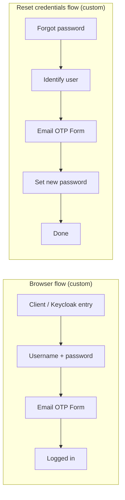

# Keycloak + Email OTP (local stack)

This repo runs **Keycloak 26.3.3** with the **[email-otp-authenticator](https://github.com/for-keycloak/email-otp-authenticator)** SPI (`email-otp-authenticator-v1.3.5-kc-26.3.5.jar`) and **PostgreSQL** (see `docker-compose.yml`).

- **Keycloak (admin & login):** [http://localhost:8081](http://localhost:8081) (host port `8081` → container `8080`)
- **Default admin (compose):** `admin` / `admin`

**SMTP is not in Compose** — you configure mail in the **Keycloak realm** (your real provider, or a local tool like **Mailpit** in another compose service: host `mailpit`, port `1025` from inside Docker).

## How to configure Email OTP in Keycloak (step by step)

Do this in the **Admin Console** for the **realm** where your users and clients live. The provider JAR must already be in `/opt/keycloak/providers/` (this repo mounts it from `docker-compose`).

### 1. Start the stack

```bash
docker compose up -d
```

### 2. Configure realm **Email** (required so OTP and reset mail can be sent)

1. **Realm settings** (select your realm) → **Email** (or **Email** / SMTP, depending on UI version).
2. Set your SMTP provider (examples):
   - **Real mailbox / provider:** host, port (`587` + StartTLS or `465` + SSL, etc.), username, password (often an **app password**), **From** address.
   - **Mailpit in Docker (optional):** host **`mailpit`**, port **`1025`**, no TLS/SSL, no auth.
3. **Save**. Use **Test connection** (or **Send test email**) if the UI offers it.

> Keycloak sends **all** email (including OTP) through this SMTP config. Wrong host/port = no mail.

### 3. **Realm** → **Login** (if you use *Forgot password*)

- Turn **Forgot password** (or **Reset password**) **ON** if you want the reset flow from the login page.
- **Save**.

### 4. **Browser login** — add **Email OTP** and bind the flow

1. **Authentication** → **Flows**.
2. Open the built-in **`browser`** flow (click the **name**).
3. On the **flow details** page, use the **action menu** (e.g. **⋮** / **Duplicate** / **Copy**) to duplicate the flow. Name it (e.g. `browser-email-otp`). Avoid special characters in the name.
4. Open your **new** flow.
5. **Add step** / **Add execution** where second factor should run (after username/password, often inside the **2FA** or **Authentication** part of the flow, depending on your template).
6. In the list of authenticators, choose **“Email OTP Form”** (from this SPI). **Do not** pick the built-in **OTP Form** / **Conditional OTP Form** / **Reset OTP** — those are TOTP/reset-TOTP, not email codes.
7. Set the new step to **REQUIRED** or **ALTERNATIVE** to match your design; adjust **order** if needed. **Save**.
8. Click the **gear (⚙)** on **Email OTP Form** and set options (see [OTP step settings](#7-otp-step-settings-gear)). **Save** each time.
9. **Authentication** → find **Flow bindings** / **Bindings** (wording depends on version).
10. Set **Browser flow** to your new flow (e.g. `browser-email-otp`). **Save**.  
    Until you do this, the realm still uses the default **`browser`** flow and your custom flow may show as **“Not in use”**.

### 5. **Forgot password** — add **Email OTP** and bind **Reset credentials** (optional)

1. **Authentication** → **Flows**.
2. Open **`reset credentials`** and **duplicate** it (same idea as in step 4: actions on the flow detail page). Name it (e.g. `reset-credentials-otp`).
3. In the **copy**, **remove** the step that **sends the password-reset *link* by email** (e.g. **Send reset email**; exact label depends on Keycloak). If you keep it, users may still get the “click link in 5 minutes” message instead of (or in addition to) OTP.
4. **Add** **Email OTP Form** in the right place: **after** the user is identified (after username / choose-user) and **before** the **Update password** / set-password steps.
5. **Configure** the step (gear) and **Save** the flow.
6. **Authentication** → **Flow bindings** → set **Reset credentials** to this new flow. **Save**.

### 6. **Users** and **roles**

- Every user that must get OTP by mail needs an **email** in their profile; user must be **Enabled**.
- If you use **“User role”** filtering in the **Email OTP** config, assign that role in **Users** → **Role mapping**.

### 7. OTP step settings (gear)

These come from the [email-otp-authenticator](https://github.com/for-keycloak/email-otp-authenticator) project (defaults in parentheses). Tune per realm/security needs:

| Area | What to set (examples) |
|------|-------------------------|
| **Basic** | **User role** (optional) — only users with that role; **Negate user role** to invert. **Code length** (6), **Code alphabet**, **Code expiration** in seconds (600). |
| **IP trust** | **Enable** to skip OTP for same IP for a while; **IP trust duration** (minutes). |
| **Device trust** | **Enable** to show a “remember this device” checkbox; **Device trust duration** (days, `0` = permanent per docs). |
| **Trust behavior** | **Trust only when sole authenticator** — whether trust applies when Email OTP is the only second factor, etc. |

**Checklist before testing:** realm **Email** (SMTP) works · users have **email** and are **enabled** · **Flow bindings** use your custom flows (table below) · you added **Email OTP Form**, not built-in TOTP **OTP** steps.

---

## Flow A — Browser login with Email OTP

End-to-end **user experience** (start → finish):

| Step | What the user does | What happens |
|------|--------------------|--------------|
| 1 | Opens your app or Keycloak URL (e.g. realm **Account** or an OIDC client). | The **Browser** flow for the realm starts. |
| 2 | Sees the login / username screen and enters **username** (or email, depending on config). | Built-in **Username / password** (or your **Forms** subflow) runs. |
| 3 | Enters **password** and continues. | Password is checked. |
| 4 | Sees the **Email OTP** screen. | **Email OTP Form** runs: Keycloak sends a time-limited code to the user’s **email** (via realm SMTP). |
| 5 | Enters the **OTP code** (and device/IP trust if you enabled those in the step config). | The plugin validates the code. |
| 6 | Redirect / session established. | User is **logged in**; client receives tokens as usual. |

**In the Admin console (typical custom flow, e.g. `browser-email-otp`):** duplicate the built-in `browser` flow, add **Email OTP Form** in the right place (usually with your 2nd-factor / “after password” part), set requirement (**REQUIRED** / **ALTERNATIVE** to match your design), open the **gear** to configure code length, expiry, roles, IP/device trust, etc.

**Binding:** **Browser flow** → your custom flow (e.g. `browser-email-otp`).

---

## Flow B — Forgot password (reset credentials) with Email OTP (no magic link)

If you only added Email OTP to the browser flow, **Forgot password** still uses the **Reset credentials** flow. To get **OTP by email** instead of the default **“click the link in email”** message, use a **copy** of the `reset credentials` flow and **remove** the step that **sends the password-reset link** (e.g. “Send reset email” or equivalent; exact label depends on Keycloak version).

**User experience (start → finish):**

| Step | What the user does | What happens |
|------|--------------------|--------------|
| 1 | On the login page, clicks **Forgot password?** | The **Reset credentials**–bound flow starts. |
| 2 | Enters **username** or **email** (as your form requires). | Keycloak **identifies the user** (choose-user / first factor steps in your copy of the flow). |
| 3 | *(If you removed the default link email)* — no “open this link in email” for reset. | The built-in “send reset **link**” email must **not** run; otherwise you get the 5-minute link mail instead of (or in addition to) OTP. |
| 4 | Sees the **Email OTP** screen. | **Email OTP Form** sends a code to the user’s email. |
| 5 | Enters the **OTP** and continues. | Code is validated. |
| 6 | Sets a **new password** (if your flow includes **Update password** / last steps). | Credentials updated; user can sign in with the new password. |
| 7 | Done. | — |

**Binding:** **Reset credentials** → your custom flow (e.g. `reset-credentials-otp`).

**Important:** the default “Someone just requested to change your credentials… **link below**” email comes from the **link-based reset** step, not from **Email OTP Form**. For OTP-only reset, that link-sending step should be **removed** from your **duplicated** reset flow (or your flow restructured so that path is not used).

---

## Visual overview



---

## Flow bindings (realm)

| Binding in Keycloak | Set to (examples) | Effect |
|---------------------|--------------------|--------|
| **Browser flow** | e.g. `browser-email-otp` | Normal **sign-in** uses **Email OTP** after password. |
| **Reset credentials** | e.g. `reset-credentials-otp` | **Forgot password** uses your reset flow (OTP, not the default link, if you removed that step). |

---

## Quick test commands (optional)

```bash
docker compose -f docker-compose.yml up -d
docker compose -f docker-compose.yml ps
```

- **Test login (replace `REALM`):** [http://localhost:8081/realms/REALM/account/](http://localhost:8081/realms/REALM/account/)  
- **Test forgot password:** use **Forgot password?** on the same login experience your realm exposes.

---

## Upstream

- SPI & options: [for-keycloak / email-otp-authenticator](https://github.com/for-keycloak/email-otp-authenticator)  
- **Pick:** **Email OTP Form** in the add-step list when you extend a flow.
